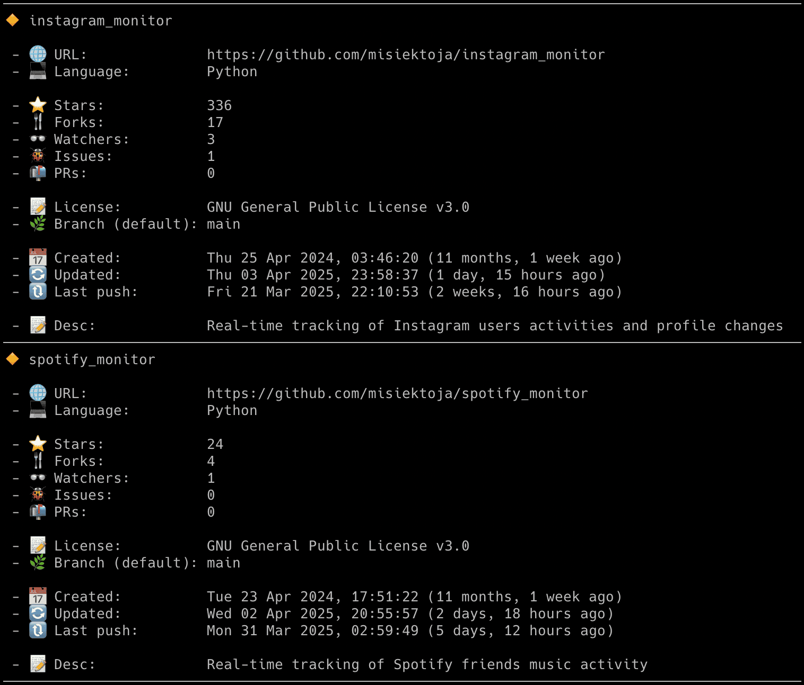

# github_monitor

github_monitor is an OSINT tool written in Python which allows for real-time monitoring of Github users activities including profile and repositories changes. 

## Features

- Real-time tracking of Github users activities including profile and repos changes:
   - new Github events for the user like new pushes, PRs, issues, forks, releases etc.
   - repositories changes like changed stargazers, watchers, forks, description, repo update date etc.
   - added/removed followings and followers
   - added/removed starred repositories
   - added/removed public repositories
   - changed user name, email, location, company, bio, blog URL
   - detection of account changes
- Email notifications for different events (new Github events, changed followings, followers, repositories, user name, email, location, company, bio, blog URL etc.)
- Saving all user activities with timestamps to the CSV file
- Clickable Github URLs printed in the console & included in email notifications (repos, PRs, commits, issues, releases etc.)
- Possibility to control the running copy of the script via signals

<p align="center">
   
</p>

## Change Log

Release notes can be found [here](RELEASE_NOTES.md)

## Disclaimer

I'm not a dev, project done as a hobby. Code is ugly and as-is, but it works (at least for me) ;-)

## Requirements

The tool requires Python 3.x.

It uses [PyGithub](https://github.com/PyGithub/PyGithub) library, also requires requests, python-dateutil, tzlocal and pytz.

It has been tested successfully on:
- macOS (Ventura & Sonoma)
- Linux:
   - Raspberry Pi Bullseye & Bookworm
   - Ubuntu 24
   - Kali Linux 2024
- Windows (10 & 11)

It should work on other versions of macOS, Linux, Unix and Windows as well.

## Installation

Install the required Python packages:

```sh
python3 -m pip install requests python-dateutil pytz tzlocal PyGithub
```

Or from requirements.txt:

```sh
pip3 install -r requirements.txt
```

Copy the *[github_monitor.py](github_monitor.py)* file to the desired location. 

You might want to add executable rights if on Linux/Unix/macOS:

```sh
chmod a+x github_monitor.py
```

## Configuration

Edit the  *[github_monitor.py](github_monitor.py)* file and change any desired configuration variables in the marked **CONFIGURATION SECTION** (all parameters have detailed description in the comments).

### Github personal access token

In order to get your Github personal access token (classic), go to your Github app settings [https://github.com/settings/apps](https://github.com/settings/apps), then click *'Personal access tokens'* -> *'Tokens (classic)'* -> *'Generate new token (classic)'*.

Copy the value of the token to **GITHUB_TOKEN** variable (or use **-t** parameter). 

### Events to monitor

You can limit the type of events that will be monitored and reported by the tool. You can do it by changing the **EVENTS_TO_MONITOR** variable.

By default all events are monitored, but if you want to limit it, then remove the *'ALL'* keyword and leave the events you are interested in, for example:

```
EVENTS_TO_MONITOR=['PushEvent','PullRequestEvent', 'IssuesEvent', 'ForkEvent', 'ReleaseEvent']
```

### Timezone

The tool will try to automatically detect your local time zone so it can convert Github API timestamps to your time. 

In case you want to specify your timezone manually then change **LOCAL_TIMEZONE** variable from *'Auto'* to specific location, e.g.

```
LOCAL_TIMEZONE='Europe/Warsaw'
```

In such case it is not needed to install *tzlocal* pip module.

### SMTP settings

If you want to use email notifications functionality you need to change the SMTP settings (host, port, user, password, sender, recipient) in the *[github_monitor.py](github_monitor.py)* file. If you leave the default settings then no notifications will be sent.

You can verify if your SMTP settings are correct by using **-z** parameter (the tool will try to send a test email notification):

```sh
./github_monitor.py -z
```

### Other settings

All other variables can be left at their defaults, but feel free to experiment with it.

## Getting started

### List of supported parameters

To get the list of all supported parameters:

```sh
./github_monitor.py -h
```

or 

```sh
python3 ./github_monitor.py -h
```

### Monitoring mode

To monitor specific user activities and profile changes, just type Github username as parameter (**misiektoja** in the example below):

```sh
./github_monitor.py misiektoja
```

It will track all user profile changes (e.g. changed followers, followings, starred repos, username, email, bio, location, blog URL, number of repositories) and also all Github events (e.g. new pushes, PRs, issues, forks, releases etc.).

If you have not changed **GITHUB_TOKEN** variable in the *[github_monitor.py](github_monitor.py)* file, you can use **-t** parameter:

```sh
./github_monitor.py misiektoja -t "your_github_classic_personal_access_token"
```

If you also want to monitor user's public repositories changes (e.g. new stargazers, watchers, forks, changed description etc.), then use **-j** parameter:

```sh
./github_monitor.py misiektoja -j
```

The tool will run infinitely and monitor the user until the script is interrupted (Ctrl+C) or killed the other way.

You can monitor multiple Github users by spawning multiple copies of the script. 

It is suggested to use sth like **tmux** or **screen** to have the script running after you log out from the server (unless you are running it on your desktop).

The tool automatically saves its output to *github_monitor_{username}.log* file (can be changed in the settings via **GITHUB_LOGFILE** variable or disabled completely with **-d** parameter).

### Listing mode

There is also other mode of the tool which displays different requested information (**-r**, **-g**, **-f** and **-l** parameters). 

If you want to display list of public repositories (with some basic statistics) for the user, then use **-r** parameter:

```sh
./github_monitor.py -r misiektoja
```

<p align="center">
   
</p>

If you want to display list of repositories starred by the user, then use **-g** parameter:

```sh
./github_monitor.py -g misiektoja
```

If you want to display list of followers and followings for the user, then use **-f** parameter:

```sh
./github_monitor.py -f misiektoja
```

If you want to get the list of recent Github events for the user then use **-l** parameter. You can also add **-n** parameter to define how many events should be displayed, by default it shows 5 last events:

```sh
./github_monitor.py -l misiektoja -n 10
```

You can use those functionalities in listing mode regardless if the monitoring is used or not (it does not interfere).

## How to use other features

### Email notifications

If you want to get email notifications for all user profile changes (e.g. changed followers, followings, starred repos, username, email, bio, location, blog URL, number of repositories), use **-p** parameter:

```sh
./github_monitor.py misiektoja -p
```

If you want to get email notifications once new Github events show up for the user (e.g. new pushes, PRs, issues, forks, releases etc.), use **-s** parameter:

```sh
./github_monitor.py misiektoja -s
```

If you want to get email notifications once changes in user's repositories are detected (e.g. changed stargazers, watchers, forks, description etc., except for update date), use **-q** parameter:

```sh
./github_monitor.py misiektoja -q
```

If you also want to get email notifications once changes in user's repositories update date are detected, then use **-u** parameter (keep in mind these email notifications might be quite verbose):

```sh
./github_monitor.py misiektoja -u
```

The last two options (**-q** and **-u**) only work if tracking of repositories changes is enabled (**-j**).

You can combine all email notifications parameters together if needed.

Make sure you defined your SMTP settings earlier (see [SMTP settings](#smtp-settings)).

Example email:

<p align="center">
   
</p>


### Saving user activities to the CSV file

If you want to save all Github user's events, profile and repositories changes in the CSV file, use **-b** parameter with the name of the file (it will be automatically created if it does not exist):

```sh
./github_monitor.py misiektoja -b github_misiektoja.csv
```

### Check interval

If you want to change the check interval to 15 mins (900 seconds) use **-c** parameter:

```sh
./github_monitor.py misiektoja -c 900
```

It is generally not recommended to use values lower than 5 minutes as new events are very often delayed by 5 mins by Github API.

### Controlling the script via signals (only macOS/Linux/Unix)

The tool has several signal handlers implemented which allow to change behavior of the tool without a need to restart it with new parameters.

List of supported signals:

| Signal | Description |
| ----------- | ----------- |
| USR1 | Toggle email notifications for all user's profile changes (-p) |
| USR2 | Toggle email notifications for new Github events (-s) |
| CONT | Toggle email notifications for user's repositories changes (except for update date) (-q) |
| PIPE | Toggle email notifications for user's repositories update date changes (-u) |
| TRAP | Increase the user check interval (by 1 min) |
| ABRT | Decrease the user check interval (by 1 min) |

So if you want to change functionality of the running tool, just send the proper signal to the desired copy of the script.

I personally use **pkill** tool, so for example to toggle new events email notifications for tool instance monitoring the *misiektoja* user:

```sh
pkill -f -USR2 "python3 ./github_monitor.py misiektoja"
```

As Windows supports limited number of signals, this functionality is available only on Linux/Unix/macOS.

### Other

Check other supported parameters using **-h**.

You can combine all the parameters mentioned earlier in monitoring mode (listing mode only supports **-r**, **-g**, **-f**, **-l**, **-n**).

## Coloring log output with GRC

If you use [GRC](https://github.com/garabik/grc) and want to have the tool's log output properly colored you can use the configuration file available [here](grc/conf.monitor_logs)

Change your grc configuration (typically *.grc/grc.conf*) and add this part:

```
# monitoring log file
.*_monitor_.*\.log
conf.monitor_logs
```

Now copy the *conf.monitor_logs* to your *.grc* directory and github_monitor log files should be nicely colored when using *grc* tool.

## License

This project is licensed under the GPLv3 - see the [LICENSE](LICENSE) file for details
